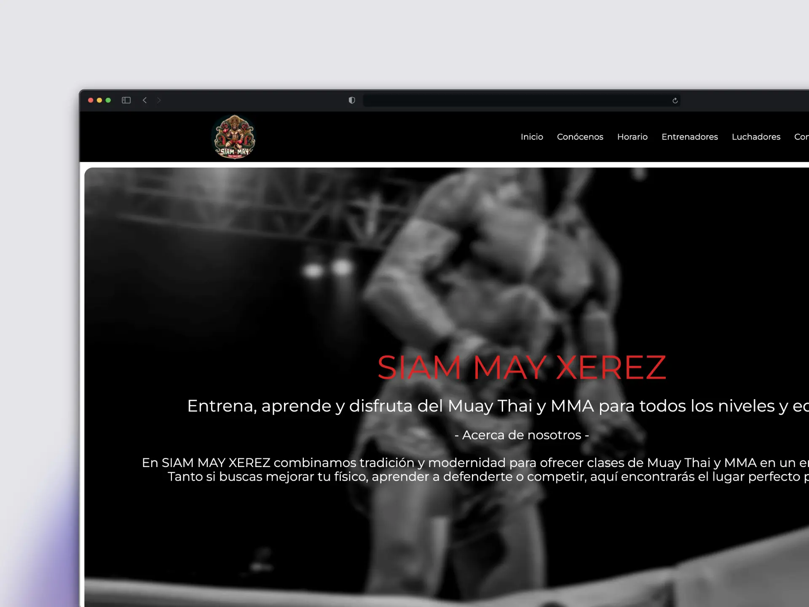

## 🥊 Siam May Thai Website

A modern and professional web platform for a Muay Thai and MMA gym, built with Astro and TailwindCSS, providing a complete digital experience for members and visitors.

<div align="center">
  <a href="https://astro.build" target="_blank">
    
  </a>
  <a href="https://tailwindcss.com" target="_blank">
    
  </a>
  <a href="https://vercel.com" target="_blank">
    
  </a>
</div>

<br />

<div align="center">
  <div style="display: flex; justify-content: center; gap: 20px; margin: 40px 0;">
    
  </div>
</div>

<br />

## ✨ Features

- 🥋 Detailed Martial Arts Programs
- 👥 Trainers and Fighters Profiles
- 📅 Class Schedule System
- 📱 Fully Responsive Design
- 🎨 Modern and Clean Interface
- 📸 Photo Gallery
- 🏆 Fighter Records and Achievements
- 📍 Location and Contact Information
- ⚡ Fast and Optimized Loading
- 🎯 SEO Optimized

## 🚀 Technologies Used

- Astro
- TypeScript
- Tailwind CSS
- @midudev/tailwind-animations
- Sharp (for image optimization)

## 🛠️ Installation

Clone the repository:

```bash
git clone https://github.com/yourusername/siam-may-thai.git
```

Install dependencies:

```bash
cd siam-may-thai
npm install
```

Start the development server:

```bash
npm run dev
```

## 📦 Project Structure

```
src/
  ├── components/           # Reusable components
  │   ├── NavBar.astro     # Navigation component
  │   ├── Intro.astro      # Hero section
  │   ├── Selector.astro   # Category selector
  │   ├── Galeria.astro    # Photo gallery
  │   └── Footer.astro     # Footer component
  ├── layouts/             # Page templates
  │   └── Layout.astro     # Main layout
  ├── pages/               # Route pages
  │   ├── index.astro      # Home page
  │   ├── entrenadores/    # Trainers section
  │   ├── luchadores/      # Fighters section
  │   └── contacto/        # Contact page
  └── images/              # Image assets
```

## 🔧 Configuration

The project uses several key configurations:

1. **Tailwind CSS**

   - Custom breakpoints for responsive design:
     - xs: 460px
     - sm: 640px
     - md: 768px
     - lg: 1024px
     - xl: 1280px
     - 2xl: 1536px
     - 3xl: 2160px

2. **Image Optimization**

   - Using Sharp for image processing
   - WebP format for better performance
   - Responsive image sizes

3. **Performance Optimizations**
   - Asset preloading
   - Image lazy loading
   - Responsive typography
   - Custom cursor implementation

## 🤝 Contributing

Contributions are welcome. Please feel free to submit a Pull Request.

## 📄 License

This project is property of Siam May Thai. All rights reserved.

## 👥 Authors

- Benjami Bono - @benjamibono

## 🙏 Acknowledgments

- Astro
- Tailwind CSS
- @midudev/tailwind-animations
- Montserrat Variable Font
